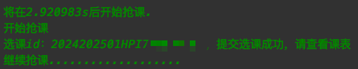
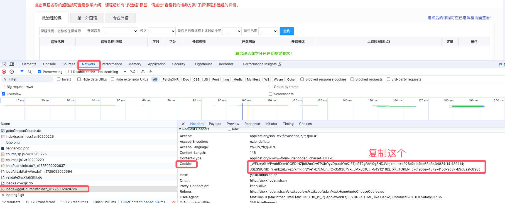
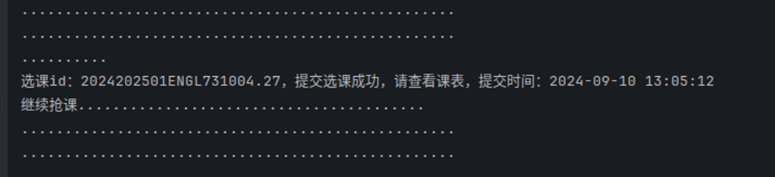
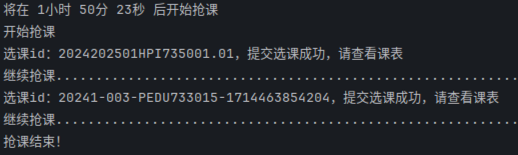
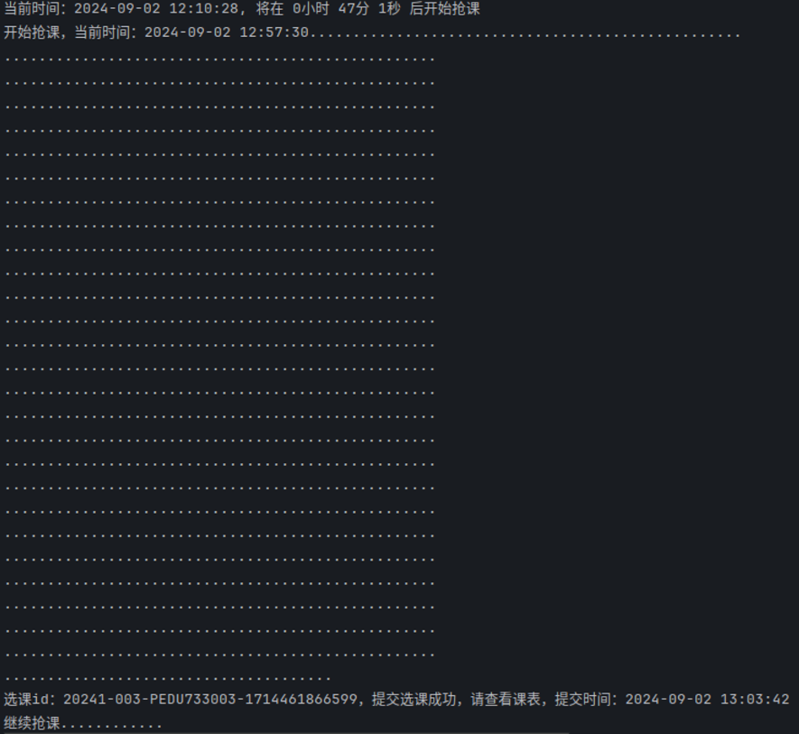
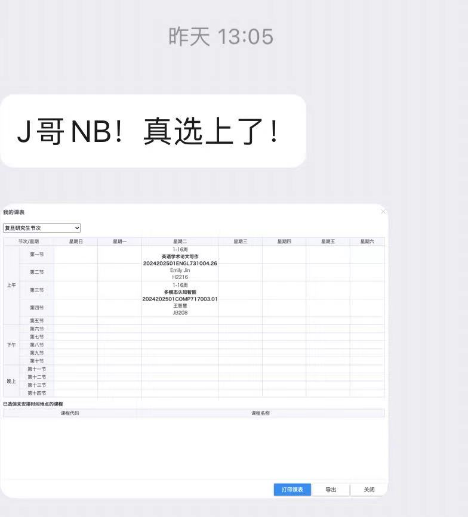
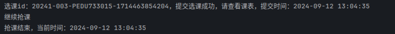

## 复旦大学研究生抢课程序
- 支持自定义时间抢课
- 支持同时抢多门课
- 支持同时抢多种类别的课

### Python版本：3.10.13
用老版本的Python基本不会出问题，有问题再换这个版本

### 使用说明
- 在course.py中的if __name__ == "__main__"的方法体中设置：
     1. cookie：获取方法请往下看
  2. 课程信息 
  3. 抢课开始时间
  4. 抢课结束时间：到达该时间后，本程序会自动结束
- 课程信息的样例已在上述方法体中给出，是一个二维数组，体现为：
    [[课程类别a,课程代码a1,课程代码a2...], [课程类别b,课程代码b1,课程代码b2...]...]
- 确保稳定性，请在每天跑该程序之前都重新获取cookies并设置(提前5分钟最佳)，以防cookie过期(有效期约3小时)
- 成功提交选课后，会提示对应的课程id  

- 本程序执行过程中，此时操作选课网站，将会频繁出现页面过期提示，但这是正常现象，在结束本程序后就会恢复正常。

### cookie获取流程
1. 在电脑浏览器中登陆你的选课账号
2. 按下"F12" 或 鼠标右键后点击"检查"，出现下图所示界面
3. 点击Network(网络) -> 按下F5刷新 -> 左下侧出现很多item -> 随便点击一个 -> 在请求头Request Headers中找到Cookie对应的内容  

### 实战结果
英语写作课(作者研二，只能在新生选课的后两周进行英语选课，但还是抢到了考核较为轻松的写作课)
  
乒乓球课  
  
羽毛球课  
  
英语写作课  
  
乒乓球课  
  

### 免责声明
- 本程序功能仅为辅助抢课，存在抢课失败几率。
- 请及时停止程序，防止学校服务器压力过大。

### 觉得本程序还不错的同学, 能否给个star呢 ：）
